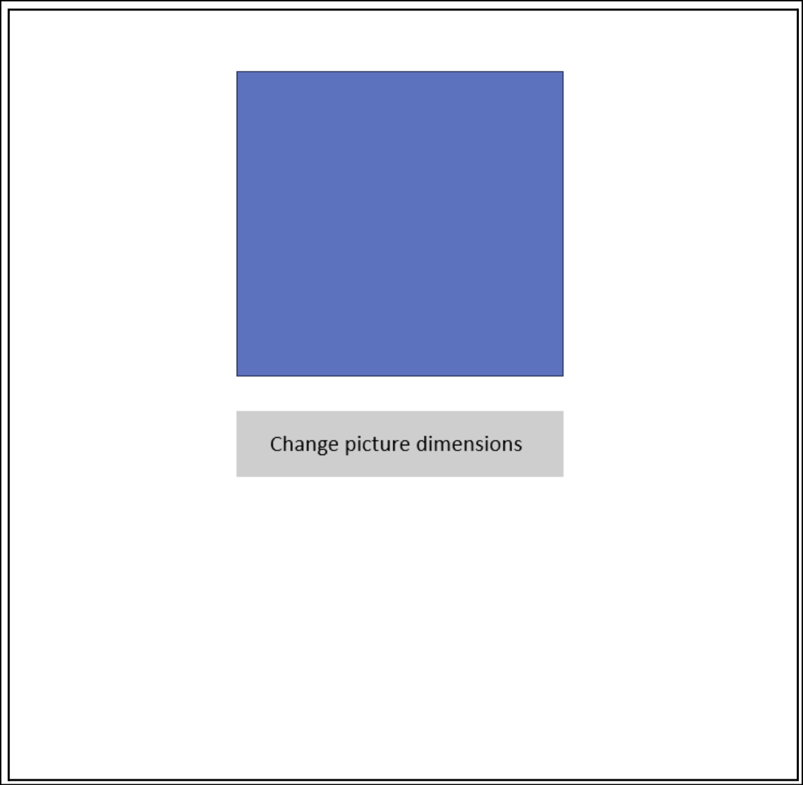

# Check-in 1

### DSL Proposal: UI Design Language designed for Kids/Teens

### Problem/Use Case
Kids/teens who want to learn how to create simple apps need to learn more complex tools and languages in order to build a functional UI. This DSL would help teach them the proper way to build UIs but using a simpler language that consists of the basic building blocks, like buttons, text, images, and containers. This would allow beginners to build some simple applications like a blog, restaurant menu, or personal website.

### Rich Features
1. UI Components can be nested within each other. This also allows a list of components to be passed to a parent component.
2. Interactive UI components.
    * allow for some kind of basic interactivity - ex: when they click on a component, they can choose to execute one or more of a set of actions. Example actions:
        * Show a different View (same as #2)
        * Open up a link to some website
        * Display an image
        * Change the color of a component
        * Drop down menu
3. Parameter passing/conditional rendering into components
    * Ex. form that checks if input box is empty 


### Possible Example Code


Components.ui
```
NavBar navBar(buttons[]):
	Items = buttons
	Color = black

Button coolButton(text, view):
	color = blue
	Text = text
	onClick = view // Connects to the passed in view which must be valid

Checkbox myCheckBox(label):
	label = label
	checked = false

Picture customPicture(url, cond):
	src = url
	visible = cond
```


Main.view
```
navBar( coolButton forEach: [
	// example of nesting + parameter passing
	("About", About),
	("Contact", Contact),
	("Pictures", Picture)
])

Text("Welcome to my website") // Default text component
coolButton("Try Me", None)
myCheckBox("Show Picture") as mc1
customPicture(
  "https://www.imgur.com/sldfkjsdlkfj",
  mc1.isChecked // conditional rendering
)
```
	
### TA Check-in Feedback
* Feature 3, parameter passing or conditional rendering would be better rich features. “Importing files” can be a nice-to-have.
* Feature 2, the decision has to be in runtime to be considered rich
    * user input, condition to check user input, predefined components
* Idea for implementation - have a list component in the template and allow for mapping
* Backend implementation should involve HTML CSS and JS


***
# Check-in 2

### Responsibilities
Note: Assigned responsibilities include both writing tests and implementation.

- **Design DSL Syntax**
    - All of us (done) 

- **Define Grammar rules**
    - Lexer grammar for components.ui: Sarah
    - Parser grammar for components.ui: Payam
    - Parser grammar for .views: Angus

- **Define AST data structure:** All of us

- **Tests:** Will be written by everyone collectively before implementation

- **Tokenization (Lexer)**
    - **Who:** Sean
    - **Input:** Components.ui + Main.view
    - **Output:** List of tokens

- **Parser**
    - **Who:** Sarah
    - **Input:** Tokens (keywords, parameters, literals, parentheses)
    - **Output:** Parse-tree produced by ANTLR

- **AST Conversion**
    - **Who:** Angus
    - **Input:** ANTLR parse-tree
    - **Output:** Our defined AST

- **Evaluator**
    - **Responsibility divided up into groups of outputted components**
        - Button, Text, Picture
        - Container, TextInput, Checkbox
    - **Who:** Elias, Payam
    - **Input:** AST Tree
    - **Output:** Components correspond to HTML elements with properties being converted into CSS and JS

### Timeline

<table>
  <thead>
    <tr>
      <th>Checkpoint</th>
      <th>Deliverables</th>
    </tr>
  </thead>
  <tbody>
    <tr>
      <td>Week 2 (Jan 22 - Jan 26)</td>
      <td>
        <ul>
          <li>Finalize definition of the grammar</li>
          <li>Define AST data structure</li>
        </ul>
      </td>
    </tr>
    <tr>
      <td>Week 3 (Jan 27 - Feb 2)</td>
      <td>
        <ul>
          <li>Implement AST data structure</li>
          <li>Implement 1 simple component to be ready for user study (parser + evaluator)</li>
          <li>Perform first user study</li>
          <li>Writing tests for AST</li>
          <li>Writing tests for component #1 (parser + evaluator)</li>
        </ul>
      </td>
    </tr>
		<tr>
      <td>Week 4 (Feb 3 - Feb 9)</td>
      <td>
        <ul>
          <li>Implementation of more complex data structures/framework (array, loop)</li>
          <li>Implementing the next 2 components</li>
          <li>Writing tests for the new data structures</li>
          <li>Writing tests for the next 2 components</li>
        </ul>
      </td>
    </tr>
    <tr>
      <td>Week 5 (Feb 10 - Feb 16)</td>
      <td>
        <ul>
          <li>Implementing the next 3 components</li>
          <li>Perform second user study</li>
          <li>Writing tests for the next 3 components</li>
        </ul>
      </td>
    </tr>
    <tr>
      <td>Week 6 (Feb 17 - Feb 26)</td>
      <td>
        <ul>
          <li>Finalizing the project</li>
          <li>Create video</li>
        </ul>
      </td>
    </tr>
  </tbody>
</table>


Team Synchronization:
1. We will hold a group meeting on weekends via Discord to discuss our responsibilities in the upcoming week.
2. We will also use a short time in or after class on Tue/Thu to share our progress and/or obstacles with the team.
3. We will use GitHub Projects to track tasks and issues.

If someone falls behind, others can still continue working on the next components, and if there is extra time available, help the teammate.

### Progress So Far

We further defined the features of our language along with most of the keywords supported. We also changed/added to our rich features and modified our timeline to address the feedback from TA. We also wrote the initial grammar rules for our lexer and parser together.

### TA Check-in Feedback

- Grouping of different types and loops are pretty complicated.
  - In our example code, we have an array of tuples - We decided not to implement that as it’s too complicated for kids.
  - A forEach loop - If we convert our input to .js file, this wouldn’t be very hard to implement.
- If we have functions within our language, we would need a call stack.
- Recommended to translate our input (Main.view & components.ui) to output.js and index.html files with DOM manipulation.
- Have a basic compiler working before the first user study.
- Re: timeline - Better to not plan too much beforehand, but rather to plan a little, then implement a little, rinse and repeat.

### Updated Rich Features
1. UI Components can be nested within each other. This also allows a list of components to be passed to a parent component.
2. Interactive UI components: allow for some kind of basic interactivity. Example actions:
    - Open up a link to some website
    - Display an image
    - Show a different View
    - Drop down menu
3. Functions that can be used to change component properties dynamically.
4. Basic arithmetic operations that can be used in functions and can be nested (+ - * /)


***
# Check-in 3

### Mockup (BEFORE USER STUDY)
Our DSL will have at least two types of files:
1. A components.ui file which will contain your component declarations
2. A main.view file which will act as your main page to render and use your components in. You can create multiple .view files as these will act as separate HTML pages.

<br />

- **Components**
  <table>
    <thead>
      <tr>
        <th>Component</th>
        <th>Properties</th>
      </tr>
    </thead>
    <tbody>
      <tr>
        <td>Button</td>
        <td>
          <ul>
            <li>color</li>
            <li>width</li>
            <li>height</li>
            <li>Text - instance of Text component</li>
            <li>onClick - handles onClick events</li>
          </ul>
        </td>
      </tr>
      <tr>
        <td>Text</td>
        <td>
          <ul>
            <li>text</li>
            <li>color</li>
            <li>fontSize</li>
            <li>fontStyle (bold, underline, italicized)</li>
          </ul>
        </td>
      </tr>
      <tr>
        <td>Picture</td>
        <td>
          <ul>
            <li>src</li>
            <li>alt</li>
            <li>visible</li>
            <li>width</li>
            <li>height</li>
          </ul>
        </td>
      </tr>
      <tr>
        <td>Checkbox</td>
        <td>
          <ul>
            <li>checked</li>
            <li>Text - instance of Text component</li>
          </ul>
        </td>
      </tr>
      <tr>
        <td>Container</td>
        <td>
          <ul>
            <li>width</li>
            <li>height</li>
            <li>color</li>
            <li>borderWidth</li>
            <li>borderColor</li>
            <li>borderStyle (dotted, dashed, solid, double, groove, ridge, inset, outset, none, hidden)</li>
            <li>display (row, column)</li>
            <li>alignItems (start, center, end)</li>
          </ul>
        </td>
      </tr>
      <tr>
        <td>TextInput</td>
        <td>
          <ul>
            <li>value</li>
            <li>width</li>
            <li>height</li>
          </ul>
        </td>
      </tr>
    </tbody>
  </table>


- **Functions (can only be assigned to onClick property)**
    - Basic mathematical operations: + 	-	*	/
    - set(component.property, x): x can be a constant (numbers/strings), a component property value or an expression (2*6/3-10)


- **Example code:**

    The following example code creates a page that contains a picture with a button below it centered on the page. If the button is clicked it changes the height and width of the picture by 100. 

    **Components.ui (BEFORE USER STUDY)**
    ```
    Button button(t, handleClick): 
      color = 'gray'
      width = 100
      height = 30
      Text = t
      onClick = handleClick

    Text text(t):
      text = t
      color = 'black'
      fontSize = 12

    Picture dynamicPicture(s):
      src = s
      width = 100
      height = 100

    Container mainContainer(components[]):
      display = 'column'
      alignItems = 'center'
    ```

    **Main.view (BEFORE USER STUDY)**
    ```
    dynamicPicture('https://randomsource.com') as dp

    text('Change picture dimensions') as changePictureButtonText

    button(changePictureButtonText, [set(dp.width, dp.width+100), set(dp.height, dp.height+100)]) as changePictureButton

    mainContainer([dp, changePictureButton])
    ```

    **Output**
    The output of the above code would have a page that looks similar to this:

    

### User Study
We performed the user study on 3 users. We introduced them with the sytax using example above and asked them to create a button which its value is incremented whenever clicked.
- **What did they find easy/difficult?**

    - **Payam’s User**
      - The component definitions were clear and the concept of defining a component and then using them was clear
      - Syntax was difficult to understand and use for someone without any programming knowledge. More specifically:
          - Where to use uppercase or lowercase in the variable definition
          - Square brackets usage was confusing for defining list
          - Renaming the component with as was confusing: it felt unnecessary because we already named it
          - Keywords (src, display, align) are confusing to understand for new users

    - **Elias’s Users**
    - Easy:
      - How to define components
      - How to use components in view
    - Difficult
        - When to hard code property values and when to use parameter passing
        - Difference between class names and variable names
        - General syntax (camel case, when to use lower case and upper case)
        - Using square brackets to define a list
        - Set functionality documentation wasn’t clear

- **What did we learn from the user study?**

    Our DSL is a bit too challenging for people with zero programming experience as we designed our language with the assumption the people using it would understand basic concepts of variable declaration and usage, parameter passing, square brackets representing lists etc. 

- **What could we have done differently?**
    - Proposed changes to our language:
        - We can change property names to be more intuitive to inexperienced programmers
        - Allowing users to pass functions into a component seems to be a bit too advanced for uninformed users. Therefore, forcing functions to only be declared within the components.ui file will make instantiations much cleaner. 
        - Square brackets should only be used for object lists. I.e. Listing objects to go in a container.
        - Could possibly require type specifications for arguments/parameters
        - To fix the confusion of when to use lowercase and uppercase, have component types be all uppercase
    - Proposed changes for our next user study:
        - File types can be changed (.ui and .view)
        - Create better documentation for how the set and arithmetic operations work
        - Create better example code (should be more related to the task)
        - Next task should involve component reusability and other rich features of our language

### Changes to our design
After the feedback we got we have made the following changes to our language:
- We’re only allowing onClick functionalities to be declared in the component definitions file and not the .view files. (ie. no functions should be passed via parameter)
- Square brackets should only be used for lists of components (ie. listing what components are in a container) or lists of functions (ie. listing a sequence of functions to do for onclick)
- Typed parameters to make it clear to users what a parameter is for.
- Instead of using the extension type ‘.ui’ for the definition files, we use ‘.def’ to make it clear it is for declarations.
- Changing property names to be more intuitive to inexperienced programmers
- Added another onClick function called open() which takes in a .view file
- Component types should be all uppercase to better distinguish between component names and variable names
- Property names are now case insensitive (ie. onClick -> onclick)
- The text property of BUTTON supports both a TEXT component or just a STRING constant
- Recursive function/component: Decided not to implement


With these changes, the example snippet in our mockup will now look like this:

  **Components.def (AFTER USER STUDY)**
  ```
  BUTTON button(TEXT t, PICTURE obj): 
    color = 'gray'
    width = 100
    height = 30
    text = t
    onclick = [set(obj.width, obj.width+100), set(obj.height, obj.height +100)]

  TEXT text(STRING t):
    text = t
    color = 'black'
    fontsize = 12

  PICTURE dynamicPicture(STRING s):
    url = s
    width = 100
    height = 100

  CONTAINER container1(COMPONENT[] components):
    display = 'column'
    alignment = 'center'
  ```

  **Main.view (AFTER USER STUDY)**
  ```
  dynamicPicture('https://randomsource.com') as dp

  text('Change picture dimensions') as changePictureButtonText

  button(changePictureButtonText, dp) as changePictureButton

  container1([dp, changePictureButton])
  ```

### Changes to our project timeline

<table>
  <thead>
    <tr>
      <th>Checkpoint</th>
      <th>Deliverables</th>
    </tr>
  </thead>
  <tbody>
    <tr>
      <td>Week 2 (Jan 22 - Jan 26)</td>
      <td>
        <ul>
          <li>Finalize definition of the grammar</li>
          <li>Define AST data structure</li>
        </ul>
      </td>
    </tr>
    <tr>
      <td>Week 3 (Jan 27 - Feb 2)</td>
      <td>
        <ul>
          <li>Implement AST data structure</li>
          <li>Implement 1 simple component to be ready for user study (parser + evaluator)</li>
          <li>Perform first user study</li>
        </ul>
      </td>
    </tr>
		<tr>
      <td>Week 4 (Feb 3 - Feb 9)</td>
      <td>
        <ul>
          <span style="color:orange">
            <li>Writing tests for AST</li>
            <li>Writing tests for component #1 (parser + evaluator)</li>
          </span>
          <li>Implementation of more complex data structures/framework (array, loop)</li>
          <li>Implementing the next 2 components</li>
          <li>Writing tests for the new data structures</li>
          <li>Writing tests for the next 2 components</li>
        </ul>
      </td>
    </tr>
    <tr>
      <td>Week 5 (Feb 10 - Feb 16)</td>
      <td>
        <ul>
          <li>Implementing the next 3 components</li>
          <li>Perform second user study</li>
          <li>Writing tests for the next 3 components</li>
        </ul>
      </td>
    </tr>
    <tr>
      <td>Week 6 (Feb 17 - Feb 26)</td>
      <td>
        <ul>
          <li>Finalizing the project</li>
          <li>Create video</li>
        </ul>
      </td>
    </tr>
  </tbody>
</table>

### Tests
- **How can your snippets be made into unit tests, and for which component(s)?**

    - Each type of component’s successful initialization should be tested.
    - Testing that a given property value type is considered when setting up components. E.g Width of 100% means component should take up size container. All components.
    - Testing that valid type-defining punctuation is allowed. E.g. ‘foo’, 23, 10px, 100%. All components.
    - A component that is assigned to open a view when clicked should change the view. For all components. 
    - Any onclick that contains a valid set function declaration should be tested to confirm that the change was made successively upon click.

- **What about planned error handling in your components? Tests for these?**

    Some tests we will do for error handling are as follows:
    - When parser cannot find a match, it should throw a ‘syntax error’,
    - During definition of a component, are all properties valid for that type of component? If not, should throw ‘invalid property’ error.
    - During definition of a component, is the component type one of the supported built-in types (BUTTON, TEXT, COMPONENT, …) ?
    - When passing parameters to the component in .view file, does the value type match the parameter type? If not, should throw ‘invalid type’ error.
    - Is the component being used in the .view file already defined in .ui ? If not, should throw ‘not defined’ error.
    - Is the operation defined in a function allowed (is in the list of supported operations for our language)? If not, should throw ‘invalid operation’ error.
    - Container has a mandatory component list parameter, so checking that there is always a list of at least one component within an instantiated container.
    - Check that the number of arguments matches the number of parameters. All components.

### TA Check-in Feedback
- Collection of code example for user studies
    - Done
- If could not find kids for the user study, change the scope to “people who are not familiar with coding”
    - Done
- Do the evaluation (output a .js function) for a simple example soon before doing the rest of the components.
    - Will do next week
- Add notes whether you will be supporting recursive function/component
    - Added to “Changes to our design” section above

# Check-In 4
### Status of Implementation
Component-wise
- Lexer grammar is implemented
- Parser grammar is implemented
- AST classes for definition are implemented
- AST classes for views are implemented

Test-wise
- Lexer tests are implemented
- Parser tests are in progress
- Evaluator tests still need to be added

### Plans for next Final User Study
- Our syntax is modified as reported in check-in 3 with the hope that it is easier to learn and read.
- We will build a better sample code and a study task with the revised syntax.
- We will also provide our users with clearer instructions for the syntax rules.
- With few of our components working, we will be able to show the results to the user directly.
- Similar to first user study, we plan to use 2-3 users who are not familiar with coding.

### Planned Timeline for Remaining Days
- Perform final user study
- Incorporate feedback from user study by updating code and tests accordingly
- Finish implementing evaluator and evaluator tests
- Implement static and dynamic checks
- Create project video

### TA Feedback
- The DSL syntax looks cleaner now!
- Parse the set() function differently than rest of code.
- Make it clear that when passing a function to the component, it will not be evaluated directly, rather it will be executed when interacting (e.g. click) with the component.
- Properly implementing types can be tricky
	- Since we have types, our onclick list of expressions will need to be carefully parsed/evaluated:
		- Static check: In the parser, we would need to check that the inputs to set() match the property’s type, OR
		- Dynamic check: We could defer this checking to the evaluator

# Check-In 5
### User Study Results
- Challenges with standard coding practices
- Lack of documentation for specifics like 
  - Property values (eg. fontstyle = normal, checked = yes)
  - What do specific property values do 
  - Types (STRING, TEXT, BOOLEAN, NUMBER, etc.)
  - What the default values for properties are 
- Confusion about parameters passing 
- Confusion about the purpose of having a components.def and DEFINE section (maybe combine them?)

### Changes to Design
At this stage, our DSL is well-established so we did not do any major changes to the design. Furthermore, we decided that the suggestions from the second user-study were not significant enough to justify the time used for the corresponding changes. However, a few changes to the test and implementation may happen during the last week as we are finalizing the project.

### Plans for final video
1. We will write a script collaboratively in the upcoming week.
2. Elias will record the screen showcasing the language input and output
3. Payam will record his voice reading the script in under 3 minutes.
4. Elias will edit the video

### Planned timeline for the remaining days
- Implementing the static and dynamic checks.
- Implementing the remaining parts of the evaluator. Since the parsing stage is finished, all members can now help with this part.
- Create the video as mentioned above.


### TA Feedback
- Video has to be 3 minutes long and 2 minutes open for QA.
- Need to be working on user study this week.
- Testing AST structure: it is simpler to do Parser+AST together
  - Assert on tree itself


